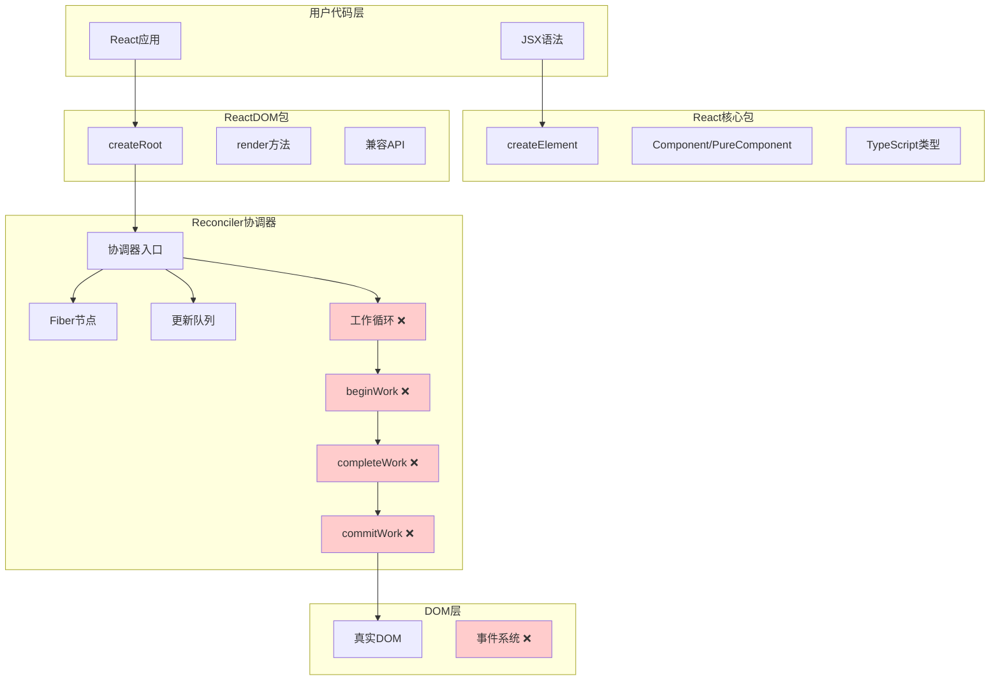
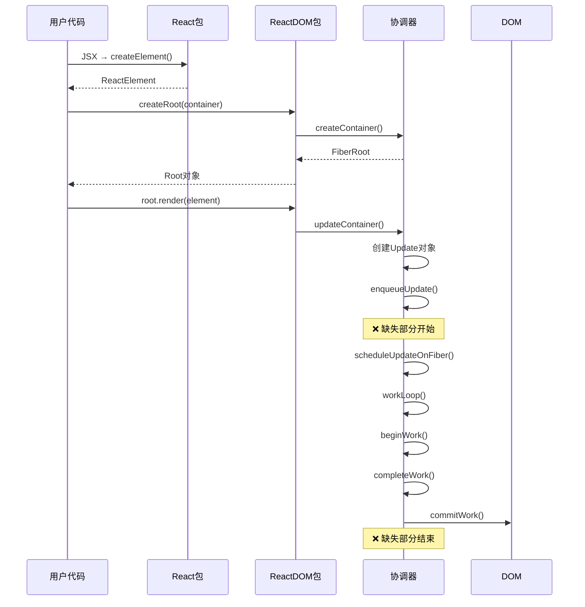
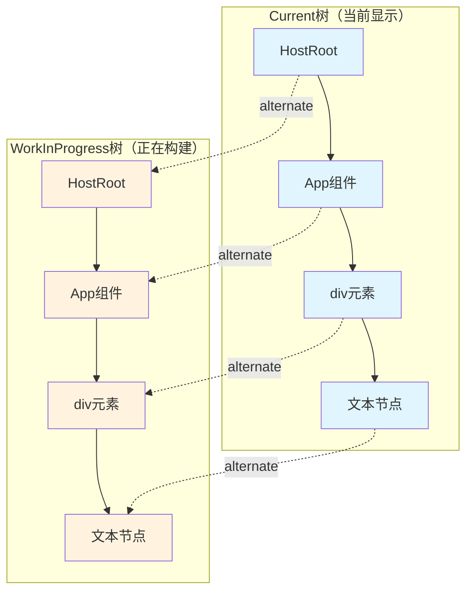
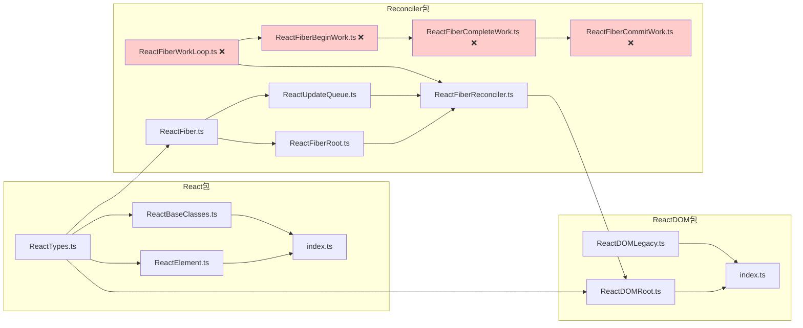
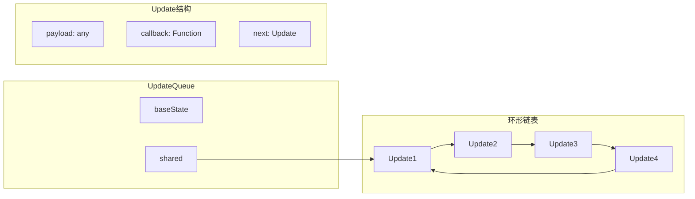
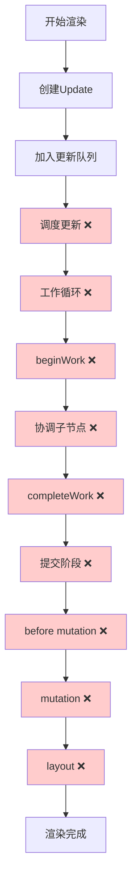
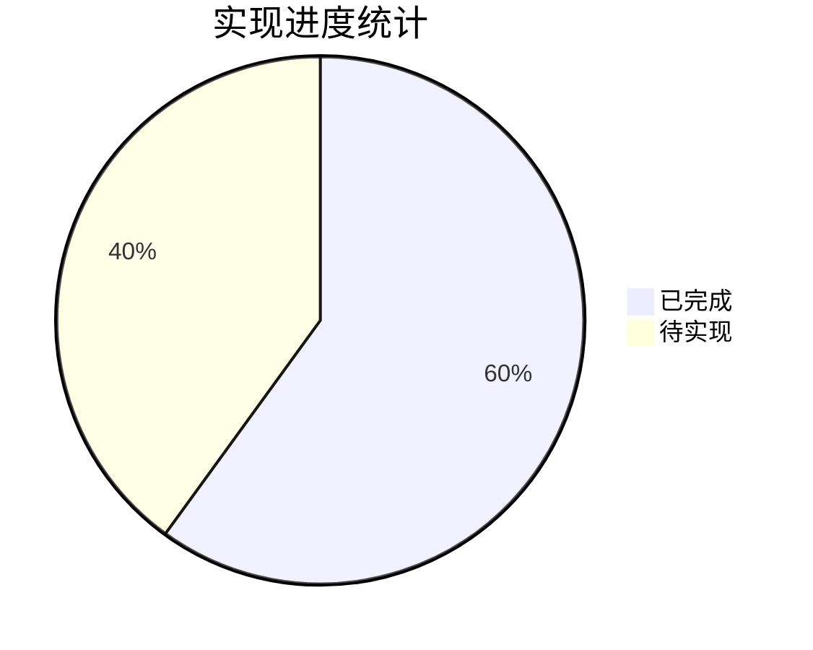
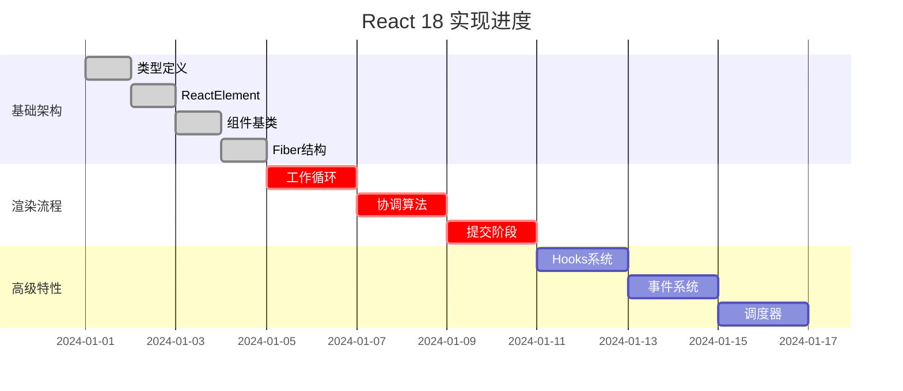

# React 18 源码架构图解

## 🏗️ 整体架构图



## 🔄 数据流向图



## 🌳 Fiber树结构图



## 📦 模块依赖关系图



## 🔧 Fiber节点结构图

```mermaid
graph TB
    subgraph "Fiber节点"
        subgraph "标识信息"
            TAG[tag: WorkTag]
            KEY[key: string]
            TYPE[type: any]
            ELEM[elementType: any]
        end
        
        subgraph "树形结构"
            RETURN[return: Fiber]
            CHILD[child: Fiber]
            SIBLING[sibling: Fiber]
        end
        
        subgraph "状态信息"
            PPROPS[pendingProps: any]
            MPROPS[memoizedProps: any]
            MSTATE[memoizedState: any]
            QUEUE[updateQueue: UpdateQueue]
        end
        
        subgraph "副作用"
            FLAGS[flags: Flags]
            SUBFLAGS[subtreeFlags: Flags]
            DELETIONS[deletions: Fiber[]]
        end
        
        subgraph "双缓冲"
            ALT[alternate: Fiber]
            STATENODE[stateNode: any]
        end
    end
```

## 🎯 更新队列结构图



## 🚀 渲染流程图



## 📊 实现进度图





## 💡 关键理解点

### 1. Fiber架构的核心优势
- **可中断性**: 长任务可以被分割成小任务
- **优先级**: 不同更新有不同的优先级
- **双缓冲**: 平滑的UI更新体验

### 2. 数据结构设计精髓
- **链表结构**: 高效的插入和删除操作
- **位运算**: 高效的标记和检查
- **环形链表**: 更新队列的高效管理

### 3. 渲染流程的两个阶段
- **协调阶段**: 可中断，计算变更
- **提交阶段**: 同步执行，应用变更

这些图表帮助您从不同角度理解React的架构设计，为后续的代码实现提供清晰的指导。